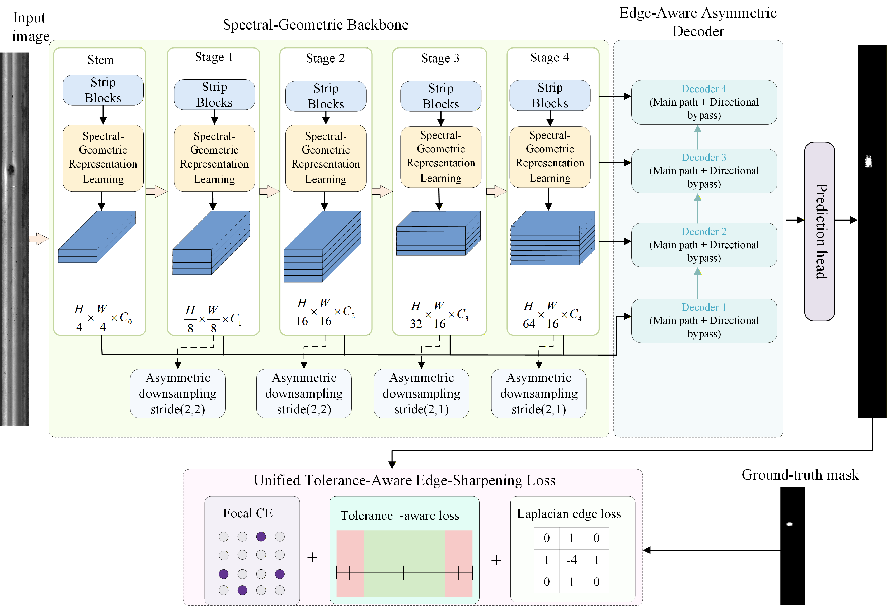

# LEADNet: Lightweight spectral-geometric segmentation for elongated and weak surface defects



---

## Table of Contents

- [1. Project Structure](#1-project-structure)
- [2. Environment Requirements](#2-environment-requirements)

---

## 1. Project Structure

```
LEADNet/
├── img/
│   ├── OVER.png                # Overall model architecture diagram
│   └── LEADNet.md              # Project documentation
├── nets/
│   ├── ExtremeStarNet.py       # Spectral-Geometric Backbone
│   ├── LEADNet.py              # LEADNet main model + Windmill decoder
│   └── unet_training.py        # Optimizer / learning rate strategy
├── utils/
│   ├── dataloader.py           # Data loading
│   ├── utils_fit.py            # Training one epoch
│   ├── utils_metrics.py        # Evaluation metrics
│   ├── callbacks.py            # Callbacks (Eval / Loss)
│   └── utils.py                # Utility functions
└── train.py                    # Training entry point
```

---

## 2. Environment Requirements

- **Python**: 3.8+
- **PyTorch**: 1.10+ (CUDA supported, GPU deployment recommended)
- **timm**: for `DropPath`, `trunc_normal_`, etc.
- **torchvision**
- **numpy**
- **Pillow**
- **thop**: for FLOPs and parameter counting
- **tensorboard**: for visualizing training loss / evaluation metrics

Installation example:

```bash
pip install torch torchvision --index-url https://download.pytorch.org/whl/cu118
pip install timm numpy pillow thop tensorboard
```
